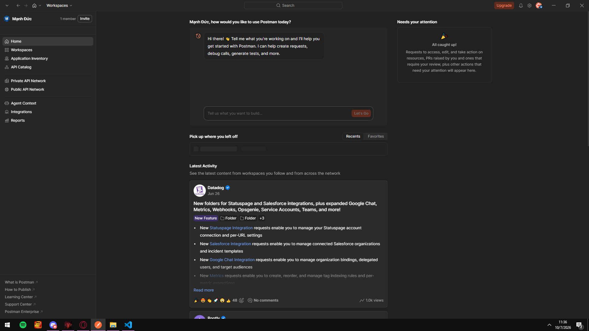
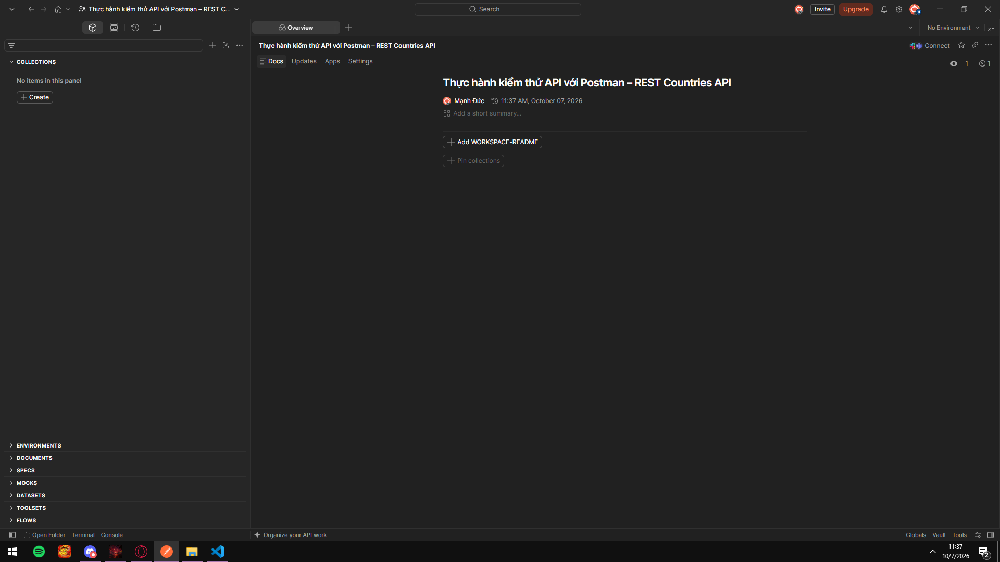
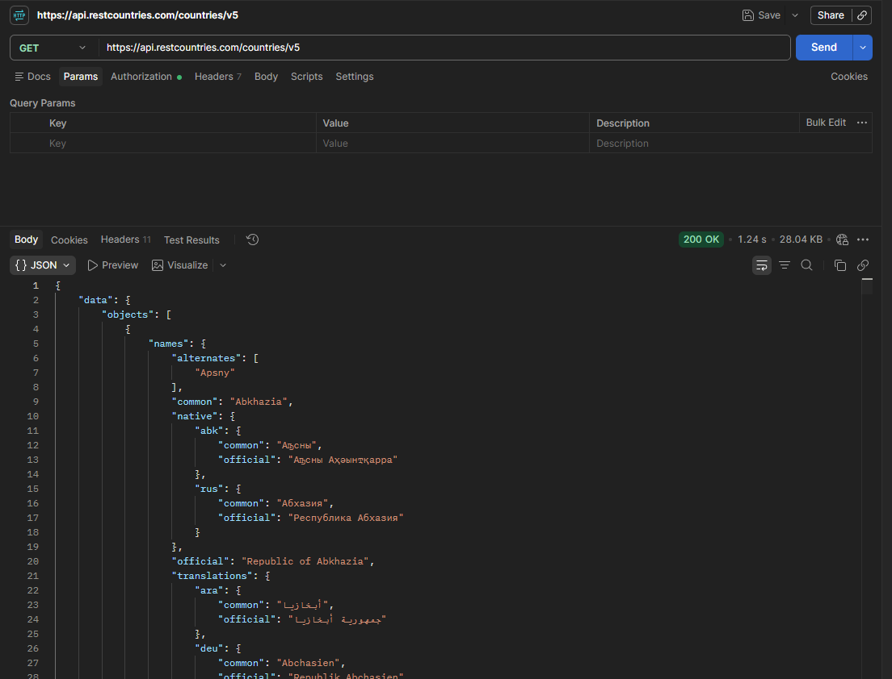
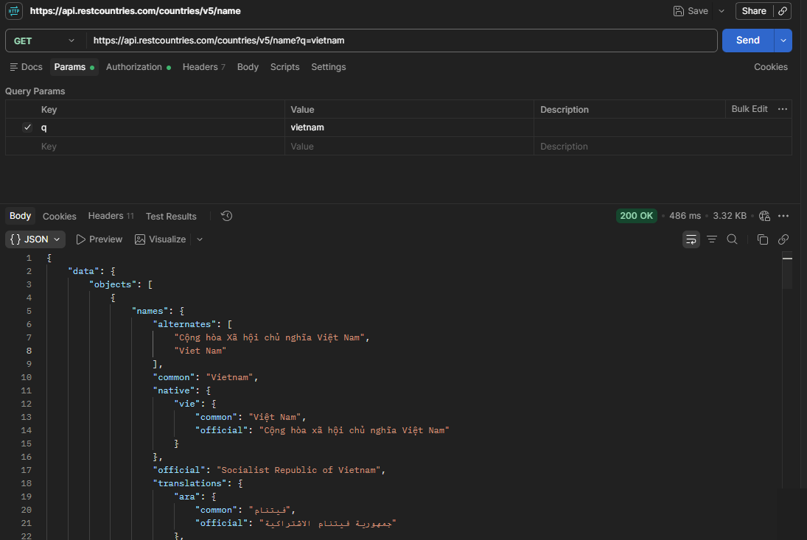
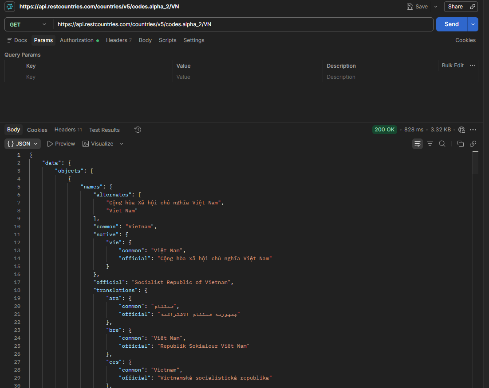
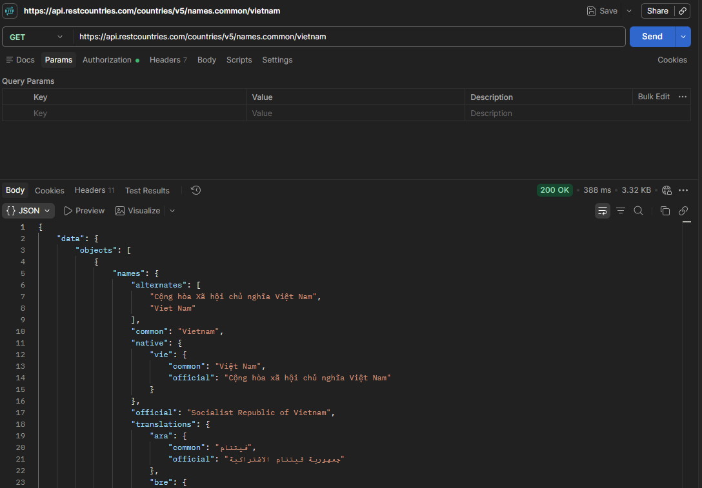

# Thực hành kiểm thử API với Postman – REST Countries API

## 1. Mục tiêu

- Hiểu Postman là gì và vai trò của nó trong kiểm thử API.
- Thực hiện được các request GET tới REST Countries API: lấy toàn bộ quốc gia, tìm theo tên, tra cứu theo mã quốc gia, tra cứu theo tên thông dụng.
- Sử dụng Environment/Variables, viết Test script và chạy Collection Runner.
- Xuất Collection để nộp cùng báo cáo.


## 2. Giới thiệu

### 2.1. Postman

Postman là công cụ dùng để thiết kế, gửi và kiểm thử các HTTP request tới API mà không cần viết code client. Các tính năng chính:

| Tính năng | Mô tả |
|---|---|
| Request | Gửi GET/POST/PUT/PATCH/DELETE, cấu hình Params, Headers, Body, Auth |
| Collection | Gom các request liên quan thành một bộ |
| Environment | Quản lý biến theo môi trường (dev, test, prod) |
| Tests | Viết script JavaScript để kiểm tra response tự động |
| Collection Runner | Chạy hàng loạt request và xem kết quả pass/fail |

### 2.2. REST Countries API

REST Countries API cung cấp thông tin về các quốc gia (tên, tên bản địa, bản dịch, mã quốc gia, ...) dưới dạng JSON. Base URL sử dụng trong bài: `https://api.restcountries.com/countries/v5`

| Endpoint | Mô tả |
|---|---|
| `GET /countries/v5` | Lấy danh sách quốc gia |
| `GET /countries/v5/name?q={từ khoá}` | Tìm quốc gia theo tên (query param `q`) |
| `GET /countries/v5/codes.alpha_2/{mã}` | Tra cứu theo mã quốc gia ISO alpha-2 (ví dụ `VN`) |
| `GET /countries/v5/names.common/{tên}` | Tra cứu theo tên thông dụng (ví dụ `vietnam`) |

Cấu trúc response chung: đối tượng `data` chứa mảng `objects`; mỗi phần tử có khối `names` gồm `common`, `official`, `alternates`, `native` và `translations`.

```json
{
  "data": {
    "objects": [
      {
        "names": {
          "alternates": ["Cộng hòa Xã hội chủ nghĩa Việt Nam", "Viet Nam"],
          "common": "Vietnam",
          "native": {
            "vie": {
              "common": "Việt Nam",
              "official": "Cộng hòa xã hội chủ nghĩa Việt Nam"
            }
          },
          "official": "Socialist Republic of Vietnam",
          "translations": { "...": "..." }
        }
      }
    ]
  }
}
```

## 3. Cài đặt

1. Tải Postman tại https://www.postman.com/downloads/ và cài đặt.
2. Đăng nhập hoặc dùng chế độ Lightweight API Client.

> **Hình 1:** Giao diện Postman sau khi cài đặt
>
> 

## 4. Thực hành

API dùng để thực hành: **REST Countries API** (`https://api.restcountries.com/countries/v5`).

### 4.1. Tạo Workspace và Collection

1. Tạo Workspace mới tên `Thực hành kiểm thử API với Postman – REST Countries API`.
2. Trong Workspace, tạo Collection tên `Bai-thuc-hanh-RestCountries` và thêm các request bên dưới.

> **Hình 2:** Workspace `Thực hành kiểm thử API với Postman – REST Countries API`
>
> 

### 4.2. Request GET – Lấy danh sách quốc gia

- Method: `GET`
- URL: `https://api.restcountries.com/countries/v5`
- Kết quả mong đợi: status `200 OK`, body có `data.objects` là mảng các quốc gia.
- Kết quả thực tế: `200 OK`, 1.24 s, 28.04 KB.

> **Hình 3:** Kết quả GET /countries/v5
>
> 

### 4.3. Request GET – Tìm quốc gia theo tên (query param)

- Method: `GET`
- URL: `https://api.restcountries.com/countries/v5/name?q=vietnam`
- Query Params:

| Key | Value |
|---|---|
| `q` | `vietnam` |

- Kết quả mong đợi: status `200 OK`, `names.common` của kết quả là `Vietnam`.
- Kết quả thực tế: `200 OK`, 486 ms, 3.32 KB.

> **Hình 4:** Kết quả GET /countries/v5/name?q=vietnam
>
> 

### 4.4. Request GET – Tra cứu theo mã quốc gia (alpha-2)

- Method: `GET`
- URL: `https://api.restcountries.com/countries/v5/codes.alpha_2/VN`
- Kết quả mong đợi: status `200 OK`, trả về đúng quốc gia có mã `VN` (Vietnam).
- Kết quả thực tế: `200 OK`, 828 ms, 3.32 KB.

> **Hình 5:** Kết quả GET /countries/v5/codes.alpha_2/VN
>
> 

### 4.5. Request GET – Tra cứu theo tên thông dụng

- Method: `GET`
- URL: `https://api.restcountries.com/countries/v5/names.common/vietnam`
- Kết quả mong đợi: status `200 OK`, trả về quốc gia có `names.common` là `Vietnam`.
- Kết quả thực tế: `200 OK`, 388 ms, 3.32 KB.

> **Hình 6:** Kết quả GET /countries/v5/names.common/vietnam
>
> 

### 4.6. Sử dụng Environment và biến

1. Tạo Environment `Test` với các biến:

| Biến | Giá trị |
|---|---|
| `baseUrl` | `https://api.restcountries.com/countries/v5` |
| `countryName` | `vietnam` |
| `countryCode` | `VN` |

2. Đổi URL các request thành:

| Request | URL |
|---|---|
| Lấy danh sách quốc gia | `{{baseUrl}}` |
| Tìm theo tên | `{{baseUrl}}/name?q={{countryName}}` |
| Tra cứu theo mã alpha-2 | `{{baseUrl}}/codes.alpha_2/{{countryCode}}` |
| Tra cứu theo tên thông dụng | `{{baseUrl}}/names.common/{{countryName}}` |

### 4.7. Viết Test script

Dán vào tab **Tests** của request GET danh sách quốc gia:

```javascript
pm.test("Status code là 200", function () {
    pm.response.to.have.status(200);
});

pm.test("Thời gian phản hồi dưới 3000ms", function () {
    pm.expect(pm.response.responseTime).to.be.below(3000);
});

pm.test("data.objects là mảng và không rỗng", function () {
    const json = pm.response.json();
    pm.expect(json).to.have.property("data");
    pm.expect(json.data.objects).to.be.an("array");
    pm.expect(json.data.objects.length).to.be.above(0);
});

pm.test("Mỗi quốc gia đều có names.common", function () {
    const objects = pm.response.json().data.objects;
    objects.forEach(function (c) {
        pm.expect(c.names).to.have.property("common");
    });
});
```

Test cho request tìm theo tên (`name?q=vietnam`):

```javascript
pm.test("Status code là 200", function () {
    pm.response.to.have.status(200);
});

pm.test("Thời gian phản hồi dưới 2000ms", function () {
    pm.expect(pm.response.responseTime).to.be.below(2000);
});

pm.test("Kết quả chứa Vietnam", function () {
    const objects = pm.response.json().data.objects;
    pm.expect(objects).to.be.an("array").that.is.not.empty;
    pm.expect(objects[0].names.common).to.eql("Vietnam");
});
```

Test cho request tra cứu theo mã `codes.alpha_2/VN`:

```javascript
pm.test("Status code là 200", function () {
    pm.response.to.have.status(200);
});

pm.test("Trả về đúng quốc gia Vietnam", function () {
    const country = pm.response.json().data.objects[0];
    pm.expect(country.names.common).to.eql("Vietnam");
    pm.expect(country.names.official).to.eql("Socialist Republic of Vietnam");
});

pm.test("Tên bản địa là Việt Nam", function () {
    const country = pm.response.json().data.objects[0];
    pm.expect(country.names.native.vie.common).to.eql("Việt Nam");
});
```

Test cho request `names.common/vietnam`:

```javascript
pm.test("Status code là 200", function () {
    pm.response.to.have.status(200);
});

pm.test("names.common là Vietnam", function () {
    const country = pm.response.json().data.objects[0];
    pm.expect(country.names.common).to.eql("Vietnam");
});

pm.test("Response có bản dịch (translations)", function () {
    const country = pm.response.json().data.objects[0];
    pm.expect(country.names).to.have.property("translations");
});
```

### 4.8. Chạy Collection Runner và xuất Collection

1. Chuột phải vào Collection `Bai-thuc-hanh-RestCountries` → **Run collection**.
2. Chọn Environment `Test`, bấm **Run** và quan sát kết quả pass/fail của từng request.
3. Xuất Collection: **… → Export → Collection v2.1** và nộp kèm báo cáo.

## 5. Bảng tổng hợp kết quả

| STT | Request | Method | Kết quả mong đợi | Kết quả thực tế | Pass/Fail |
|---|---|---|---|---|---|
| 1 | Lấy danh sách quốc gia (`/countries/v5`) | GET | 200 | 200 OK – 1.24 s – 28.04 KB | Pass |
| 2 | Tìm theo tên (`/name?q=vietnam`) | GET | 200 | 200 OK – 486 ms – 3.32 KB | Pass |
| 3 | Tra cứu theo mã alpha-2 (`/codes.alpha_2/VN`) | GET | 200 | 200 OK – 828 ms – 3.32 KB | Pass |
| 4 | Tra cứu theo tên thông dụng (`/names.common/vietnam`) | GET | 200 | 200 OK – 388 ms – 3.32 KB | Pass |
